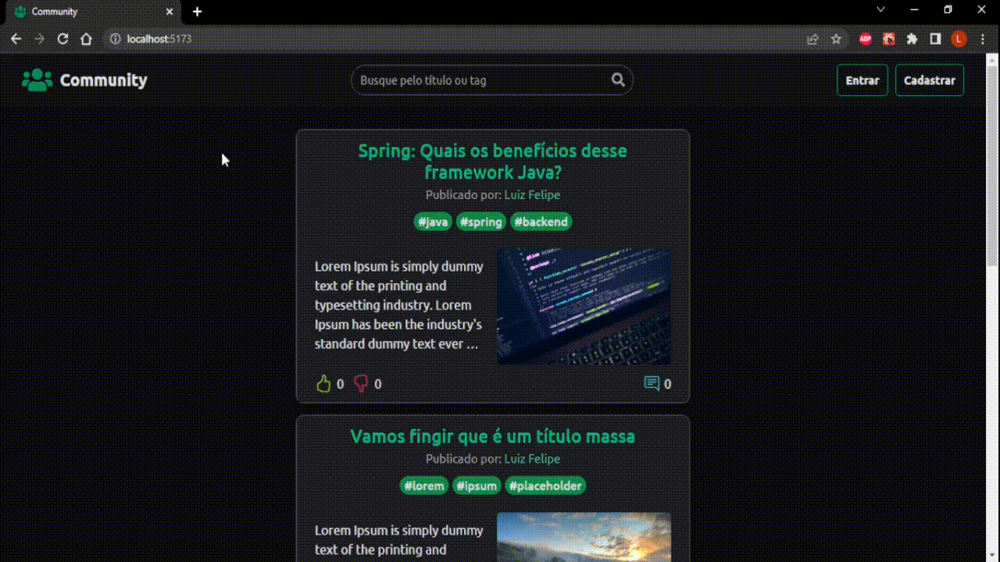
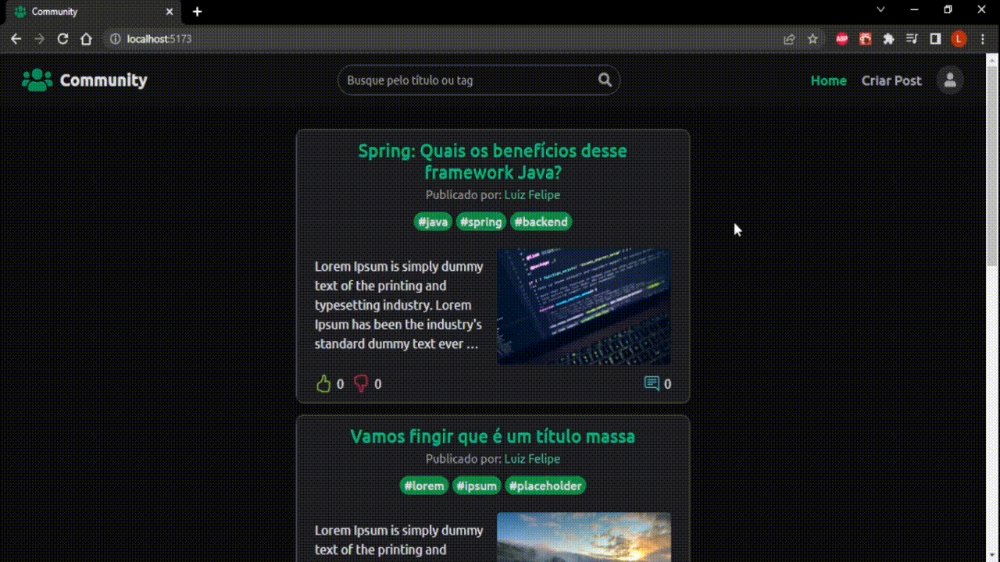

# Community - Plataforma de interatividade

O Community é uma aplicação de interatividade em um formato semelhante a um blog, onde os usuários podem compartilhar conhecimento e coisas do seu interesse, além de poder interagir na seção de comentários de cada post.
<br /><br />

<p align="center">
    <a href="#demonstracao">Demonstração da aplicação</a> •
    <a href="#backend">Backend</a> •
    <a href="#frontend">Frontend</a> •
    <a href="#run">Como rodar a aplicação</a> •
    <a href="#license">Licença</a>
</p>

<br />

<h1 id="demonstracao">Demonstração</h1>

- Criando conta e logando no sistema


<br />

- Atualizando dados de usuário e definindo imagem de perfil


<br />

- Criando um post


<br />

- Editando e deletando um post


<br />

- Dando like, dislike e salvando o post como favorito


<br />

- Adicionando e excluindo comentários em um post


<br />

- Buscando posts pelo título ou pela tag


<br />

- Layout responsivo

<br /><br />


<br />

<h1 id="backend">Backend</h1>
Esta aplicação é uma API desenvolvida sob a arquitetura MVC em NodeJS, em conjunto com o framework Express JS e o banco de dados MongoDB. Para autenticação, foi utilizado a biblioteca JSON Web Token (JWT), e bcryptjs para criptografia dos dados. Para upload de imagens, foi utilizado a biblioteca Multer, e bibliotecas como o Morgan e Winston para criar e registar logs do sistema.
<br /><br />

## 💻 Tecnologias utilizadas
As seguintes ferramentas foram utilizadas na construção do projeto:
- [Typescript](https://www.typescriptlang.org/)
- [Node Js](https://nodejs.org/en)
- [Express Js](https://expressjs.com/pt-br/)
- [MongoDB Atlas](https://www.mongodb.com/atlas/database)
- [JSON Web Token (JWT)](https://github.com/auth0/node-jsonwebtoken)
- [bcryptjs](https://github.com/dcodeIO/bcrypt.js)
- [Multer](https://github.com/expressjs/multer)
- [Morgan](https://github.com/expressjs/morgan)
- [Winston](https://github.com/winstonjs/winston)
- [dotenv](https://github.com/motdotla/dotenv)
- [cors](https://github.com/expressjs/cors)
- [Mongoose](https://mongoosejs.com/docs/guide.html)
- [class-validator](https://github.com/typestack/class-validator)
- [class-transformer](https://github.com/typestack/class-transformer)

## 🚀 Funções/Recursos
Principais funções e recursos da aplicação:
- **Autenticação:** autenticação de usuário com [JSON Web Token (JWT)](https://github.com/auth0/node-jsonwebtoken).
- **Upload e armazenamento de imagens:** upload de imagens utilizando a biblioteca [Multer](https://github.com/expressjs/multer), e armazenamento utilizando o [módulo fs](https://nodejs.org/dist/latest-v18.x/docs/api/fs.html) do Node Js.
- **Logs do sistema:** sistema de registro de logs com o [Morgan](https://github.com/expressjs/morgan) e [Winston](https://github.com/winstonjs/winston), para monitorar de maneira mais clara o funcionamento da aplicação.
- **Validação:** validação dos dados vindos da requisição com [class-validator](https://github.com/typestack/class-validator) e [class-transformer](https://github.com/typestack/class-transformer).
- **Armazenamento:** armazenamento dos dados em nuvem com o serviço [MongoDB Atlas](https://www.mongodb.com/atlas/database).

## 🛠 Pré-requisitos
- Ter uma conta no serviço MongoDB Atlas, com um cluster criado e devidamente configurado ([Configurar MongoDB Atlas](https://www.mongodb.com/docs/atlas/getting-started/)).
- Ter instalado o [Git](https://git-scm.com/) e o [NodeJs](https://nodejs.org/en/).

<h1 id="frontend">Frontend</h1>

<h1 id="run"> ⚙ Como rodar a aplicação </h1>

Com o auxílio de um terminal, precisamos rodar alguns comandos para executar o projeto:
- Primeiro, clone este repositório:
    ```bash
    $ git clone https://github.com/luizfelipeapolonio/community
    ```
- Acesse a pasta da aplicação:
    ```bash
    $ cd community
    ```

<h1 id="license">📝 Licença</h1>

Este repositório está licenciado pela **MIT LICENSE**. Para mais informações detalhadas, leia o arquivo [LICENSE](./LICENSE) contido neste repositório.